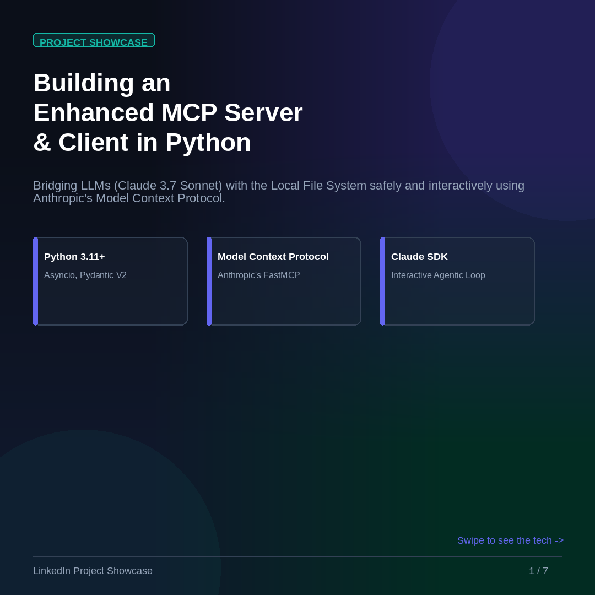
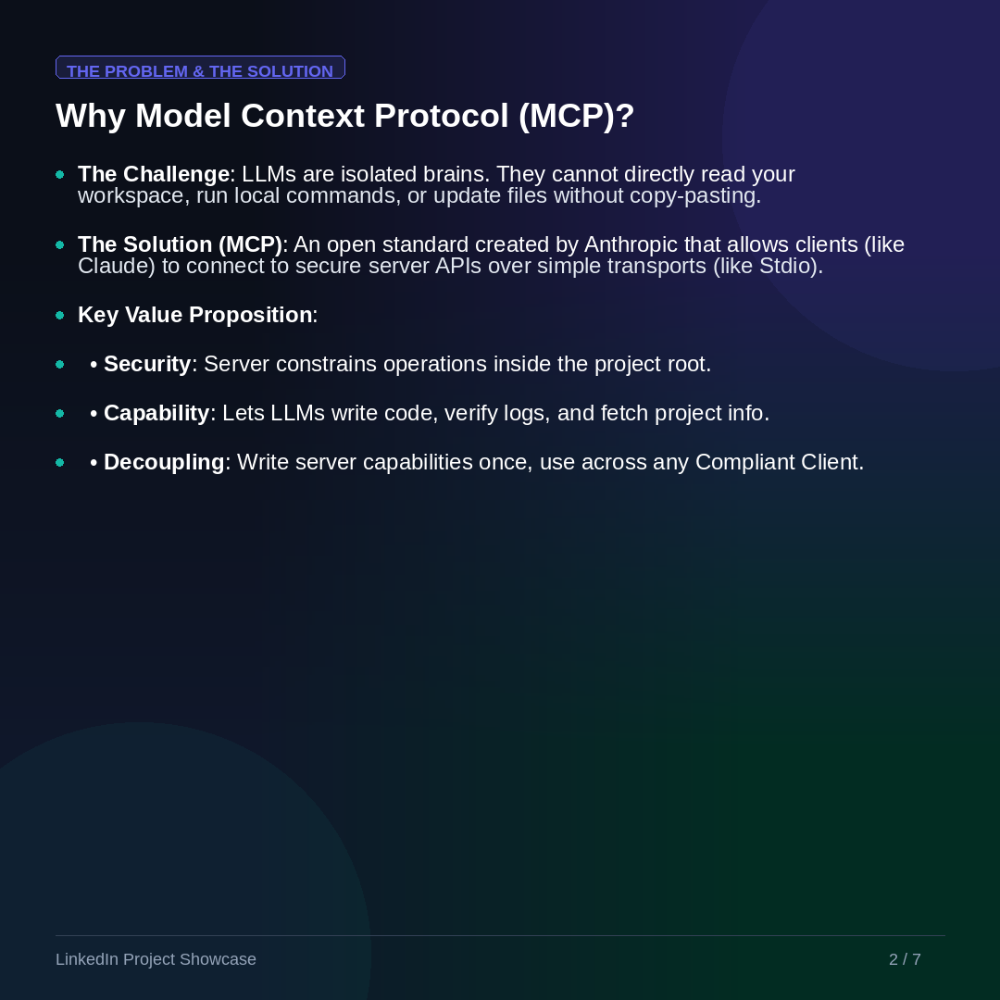
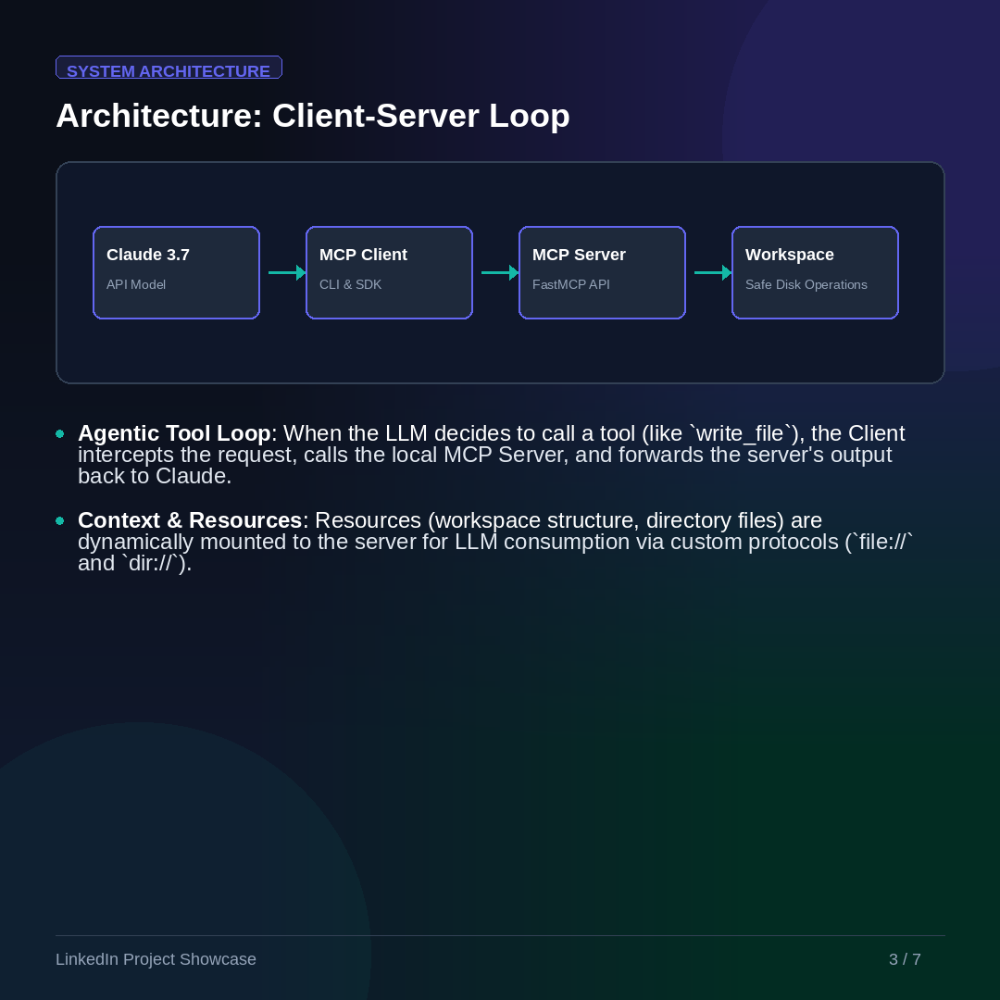
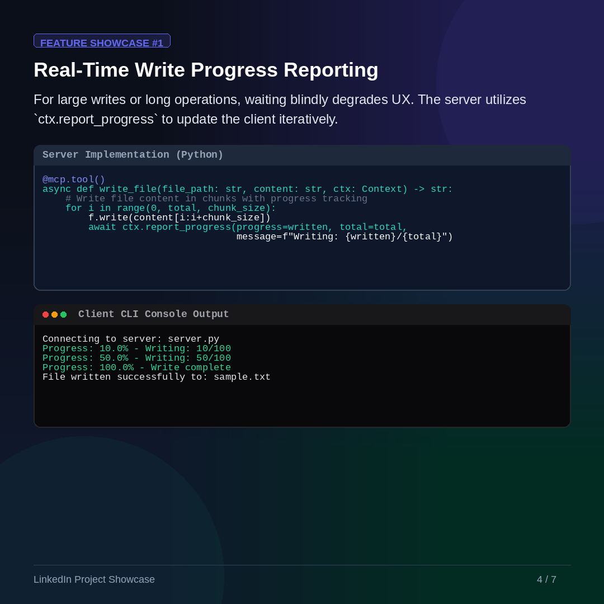
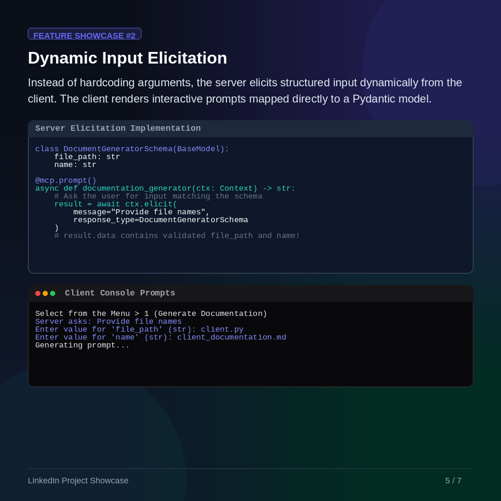
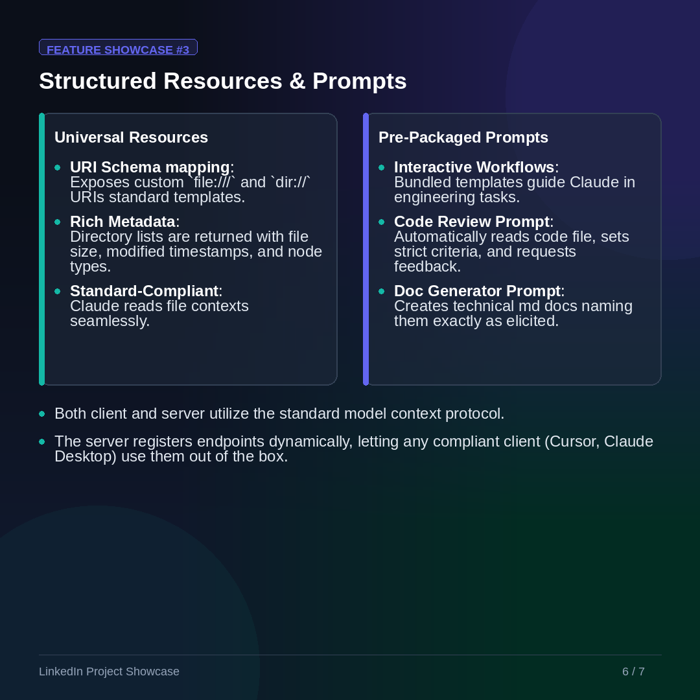
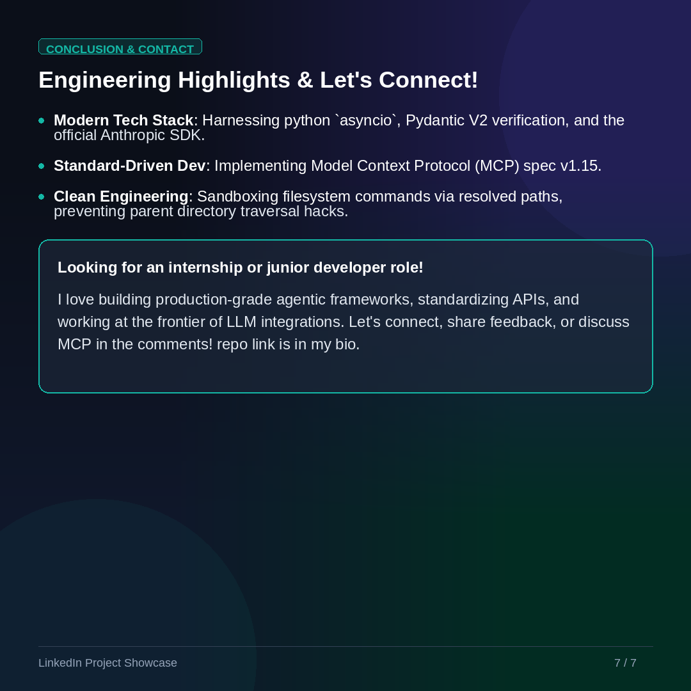

# Enhanced MCP Server

This repository contains an enhanced implementation of the Model Context Protocol (MCP) server, designed to provide improved capabilities for integrating language models with external tools and data sources.

## Features

- Enhanced tool calling capabilities
- Improved resource management
- Extended protocol support
- Better error handling and logging

## Slideshow

Below is a presentation showcasing the features and architecture of the Enhanced MCP Server:









## Installation

```bash
git clone https://github.com/mrleles/enhanced-mcp-server.git
cd enhanced-mcp-server
# Follow installation instructions in the documentation
```

## Usage

(Add usage instructions here)

## Contributing

Contributions are welcome! Please feel free to submit a Pull Request.

## License

This project is licensed under the MIT License.